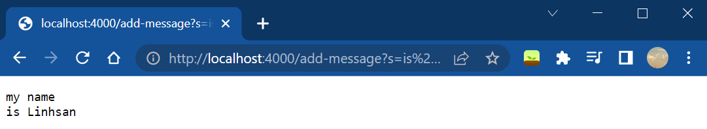

# Lab Report 2 - Servers and Bugs
Goal: 

### Part 1
`StringServer` displays all, including previous, incoming string requests, each on a newline, since the start of the server.
- start server with following java commands to launch the server locally (ctrl-C to stop the server from running)

    
    
- incoming string request form: `/add-message?s=<string>`
- code for the server as follows:
    ```java
    import java.io.IOException;
    import java.net.URI;
    import java.util.ArrayList;

    class Handler implements URLHandler {
        // The one bit of state on the server: a number that will be manipulated by
        // various requests.
        ArrayList<String> str_list = new ArrayList<String>();

        public String handleRequest(URI url) {
            if (url.getPath().equals("/")) {
                return String.format("Linhsan's String Server");
            } 
            else {
                System.out.println("Path: " + url.getPath());
                if (url.getPath().contains("/add-message")) {
                    String[] parameters = url.getQuery().split("=");
                    if (parameters[0].equals("s")) {
                        str_list.add(parameters[1]);
                    }
                    String result = "";
                    for(String element:str_list) {
                        result += element + "\n";
                    }
                    return result;
                }
            }
            return "404 Not Found!";
        }
    }

    class StringServer {
        public static void main(String[] args) throws IOException {
            if(args.length == 0){
                System.out.println("Missing port number! Try any number between 1024 to 49151");
                return;
            }

            int port = Integer.parseInt(args[0]);

            Server.start(port, new Handler());
        }
    }
    ```
- examples of output:

    
    
    
    
    - When the first string request `http://localhost:4000/add-message?s=my%20name` comes in, the `handleRequest()` method is called taking in the url `new URI("http://localhost:4000/add-message?s=my%20name")`. 
    - The ArrayList 'str_list', initially empty, now has has its first element as parameter[1], extracted via `url.getQuery().split("=")` and the nested-if condition. 
    - Note that the `url.getQuery()` extracts the part that follows the `?` (the query component) of the url and then the `split("=")` method splits into substrings whatever is separated by the `=`. 
    - In addition, because space characters are not allowed in urls, the path was auto-filled with the url-encoding for the space character `%20`, so that "my name" is interpreted as a single string. 

    
    
    - Similarly, the next string request `http://localhost:4000/add-message?s=is%20Linhsan` has `handlerequest()` with `new URI("http://localhost:4000/add-message?s=is%20Linhsan")` as input. 
    - The ArrayList `str_list` now has two elements: ["my name","is Linhsan"]. All the elements of `str_list` is concatenated, each separated by a newline, in the variable `result` to be returned as a single output.

### Part 2
Here's a buggy program:
```java
public class ArrayExamples {

  // Changes the input array to be in reversed order
  static void reverseInPlace(int[] arr) {
    for(int i = 0; i < arr.length; i += 1) {
      arr[i] = arr[arr.length - i - 1];
    }
  }
}
```
(java command to run JUnit test for Windows)
```
$ javac -cp ".;lib/hamcrest-core-1.3.jar;lib/junit-4.13.2.jar" *.java
$ java -cp ".;lib/junit-4.13.2.jar;lib/hamcrest-core-1.3.jar" org.junit.runner.JUnitCore ArrayTests
```
- A failure-inducing input for the buggy program:
    
    (JUnit test)
    ```java
    public class ArrayTests {
      @Test
      public void testReverseInPlace2() {
        int[] input = {1,2,3,4};
        ArrayExamples.reverseInPlace(input);
        assertArrayEquals(new int[]{4,3,2,1}, input);
      }
    }
    ```
    (symptom)
    

- The following input doesn’t induce a failure:

    (JUnit Test)
    ```java
    public class ArrayTests {
        @Test 
        public void testReverseInPlace1() {
        int[] input = { 3 };
        ArrayExamples.reverseInPlace(input);
        assertArrayEquals(new int[]{ 3 }, input);
        }
    }
    ```
    (no symptom)
    

- Code after fixing bug:
    ```java
    public class ArrayExamples {

      // Changes the input array to be in reversed order
      static void reverseInPlace(int[] arr) {
        for(int i = 0; i < (arr.length/2); i += 1) {
          int temp = arr[i];
          arr[i] = arr[arr.length-i-1];
          arr[arr.length-i-1] = temp;
        }
      }
    }
    ```

Briefly describe why the fix addresses the issue.

### Part 3
