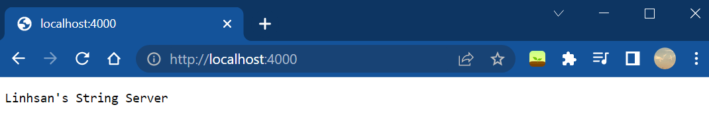

# Lab Report 2 - Servers and Bugs
Goal: 

### Part 1.
`StringServer` displays all, including previous, incoming string requests, each on a newline, since the start of the server.
- incoming string request form: `/add-message?s=<string>`
- code for the server as follows:
    ```java
    import java.io.IOException;
    import java.net.URI;
    import java.util.ArrayList;

    class Handler implements URLHandler {
        // The one bit of state on the server: a number that will be manipulated by
        // various requests.
        ArrayList<String> str_list = new ArrayList<String>();

        public String handleRequest(URI url) {
            if (url.getPath().equals("/")) {
                return String.format("Linhsan's String Server");
            } 
            else {
                System.out.println("Path: " + url.getPath());
                if (url.getPath().contains("/add-message")) {
                    String[] parameters = url.getQuery().split("=");
                    if (parameters[0].equals("s")) {
                        str_list.add(parameters[1]);
                    }
                    String result = "";
                    for(String element:str_list) {
                        result += element + "\n";
                    }
                    return result;
                }
            }
            return "404 Not Found!";
        }
    }

    class StringServer {
        public static void main(String[] args) throws IOException {
            if(args.length == 0){
                System.out.println("Missing port number! Try any number between 1024 to 49151");
                return;
            }

            int port = Integer.parseInt(args[0]);

            Server.start(port, new Handler());
        }
    }
    ```
- examples of output:

    
    
    
    
    
    
Notice that, in the code, the outputs of the first and second screenshots resulted from method `handleRequest()` which takes in the 'URI url'. Then, it enters the `else` statement and concatenates the incoming string request to the, if any, previously concatenated string requests, each separated by a newline `\n` in the variable `result`.
*note: Screenshot below shows java commands to launch the server locally. Use Ctrl-C in the terminal to stop the server from running.*

    
