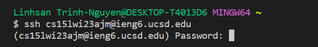

# Week 1 – Markdown, URLs, Paths, and the Filesystem

In enrolling in CSE 15L, the UCSD server automatically creates a directory for each student. You need to get the specifier associated with that directory: <mark>cs15lwi23zzz@ieng6.ucsd.edu</mark> where zzz will be unique to you. This will allow remote connection to a computer in the CSE basement

### Step 1. Course-Specific Account on ieng6
1. Go to this [web](https://sdacs.ucsd.edu/~icc/index.php)
2. System (arbitrarily) requires you to [change password](https://docs.google.com/document/d/1hs7CyQeh-MdUfM9uv99i8tqfneos6Y8bDU0uhn1wqho/edit). The current password refers to your school password.
3. Note your <mark>cs15lwi23zzz</mark>
### Step 2. Install VScode [here](https://code.visualstudio.com/)
(the VScode environment should look like the below)

### Step 3. Remotely Connecting
1. MAC automatically have git. If Windows, install git [here](https://gitforwindows.org/)
2. [Set the default terminal](https://stackoverflow.com/a/50527994) in VScode to the installed git bash
3. In your VScode terminal, type <mark>$ ssh cs15lwi23zz@ieng6.ucsd.edu</mark> and ENTER
(don't include the $ which is used to denote terminal commands)
4. Type in your password to login. Note: when you're typing the password, it will not be displayed to screen.

5. Type <mark>yes</mark> and ENTER when asked if you want to continue connecting. So far, the below is what you should have:

              ⤇ ssh cs15lwi23zz@ieng6.ucsd.edu
              The authenticity of host 'ieng6-202.ucsd.edu (128.54.70.227)' can't be established.
              RSA key fingerprint is SHA256:ksruYwhnYH+sySHnHAtLUHngrPEyZTDl/1x99wUQcec.
              Are you sure you want to continue connecting (yes/no/[fingerprint])? yes
              Password: 
              
7. The remote connection is a success if you see something like this:

              Last login: Sun Jan  2 14:03:05 2022 from 107-217-10-235.lightspeed.sndgca.sbcglobal.net
              quota: No filesystem specified.
              Hello cs15lwi23zz, you are currently logged into ieng6-203.ucsd.edu

              You are using 0% CPU on this system

              Cluster Status 
              Hostname     Time    #Users  Load  Averages  
              ieng6-201   23:25:01   0  0.08,  0.17,  0.11
              ieng6-202   23:25:01   1  0.09,  0.15,  0.11
              ieng6-203   23:25:01   1  0.08,  0.15,  0.11

              Sun Jan 02, 2022 11:28pm - Prepping cs15lwi23
              
### Step 4. Try Some Commands
