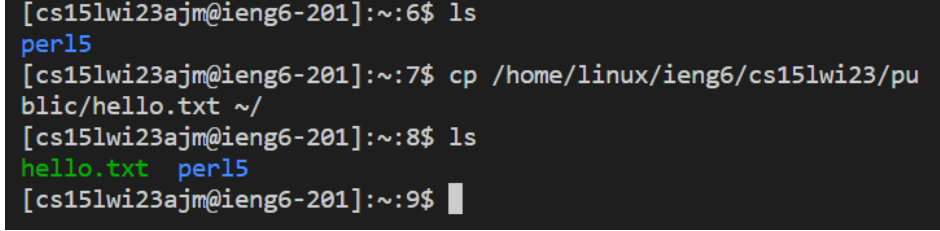

# Lab Report 1

Goal: To establish a remote connection to a computer in the CSE basement. 

### Step 1. Course-Specific Account on ieng6
Each student has an account `cs15lwi23zzz@ieng6.ucsd.edu` where the zzz is the unique specifier in order to make the remote connection. Let's find your account now.
1. Go to this [web](https://sdacs.ucsd.edu/~icc/index.php)
2. System (arbitrarily) requires you to [change password](https://docs.google.com/document/d/1hs7CyQeh-MdUfM9uv99i8tqfneos6Y8bDU0uhn1wqho/edit). The current password refers to your school password.
3. Note your zzz in your `cs15lwi23zzz`

### Step 2. Install VScode [here](https://code.visualstudio.com/)
In order to keep everyone's work uniform, we're going to use VScode.
(the VScode environment should look like the below)

### Step 3. Remotely Connecting
*note, after each input in the terminal, remember to press the ENTER key
1. MAC automatically have git. If Windows, install git [here](https://gitforwindows.org/)
2. [Set the default terminal](https://stackoverflow.com/a/50527994) in VScode to the installed git bash
3. In your VScode terminal, type `$ ssh cs15lwi23zz@ieng6.ucsd.edu`
(don't include the $ which is used to denote terminal commands)
4. Type in your password to login. Note: when you're typing the password, it will not be displayed to screen.

5. Type `yes` when asked if you want to continue connecting. So far, the below is what you should have:

              ⤇ ssh cs15lwi23zz@ieng6.ucsd.edu
              The authenticity of host 'ieng6-202.ucsd.edu (128.54.70.227)' can't be established.
              RSA key fingerprint is SHA256:ksruYwhnYH+sySHnHAtLUHngrPEyZTDl/1x99wUQcec.
              Are you sure you want to continue connecting (yes/no/[fingerprint])? yes
              Password: WhateverPasswordYouChangedToinStep1
              
7. The remote connection is a success if you see something like this:

              Last login: Sun Jan  2 14:03:05 2022 from 107-217-10-235.lightspeed.sndgca.sbcglobal.net
              quota: No filesystem specified.
              Hello cs15lwi23zz, you are currently logged into ieng6-203.ucsd.edu

              You are using 0% CPU on this system

              Cluster Status 
              Hostname     Time    #Users  Load  Averages  
              ieng6-201   23:25:01   0  0.08,  0.17,  0.11
              ieng6-202   23:25:01   1  0.09,  0.15,  0.11
              ieng6-203   23:25:01   1  0.08,  0.15,  0.11

              Sun Jan 02, 2022 11:28pm - Prepping cs15lwi23
              
### Step 4. Try Some Commands (listed below)
- `cd ~`
- `cd`
- `ls -lat`
- `ls -a`
- `ls <directory>` where `<directory>` is
`/home/linux/ieng6/cs15lwi22/cs15lwi22abc`, where the `abc` is one of the other
group members' username
- `cp /home/linux/ieng6/cs15lwi22/public/hello.txt ~/`
- `cat /home/linux/ieng6/cs15lwi22/public/hello.txt`

Try figuring out what the above commands do. For example:
  

  
Initially, the current working directory only has one file called “perl5”. After inputting the command `cp /home/linux/ieng6/cs15lwi23/public/hello.txt ~/`, the command copied the file from the specified pathway to my home directory as denoted by the tilda. If the command didn’t have the tilda, then the copy of the file would have been made in the current working directory. 

### Done! Type `exit` to stop the remote connection.
